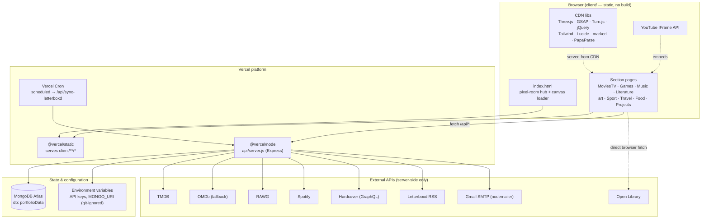
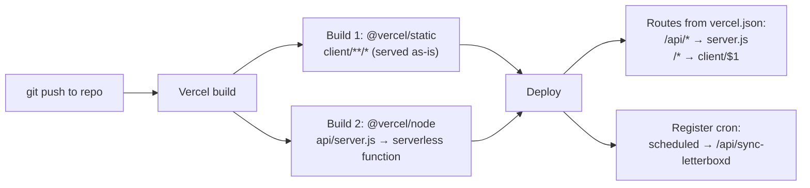
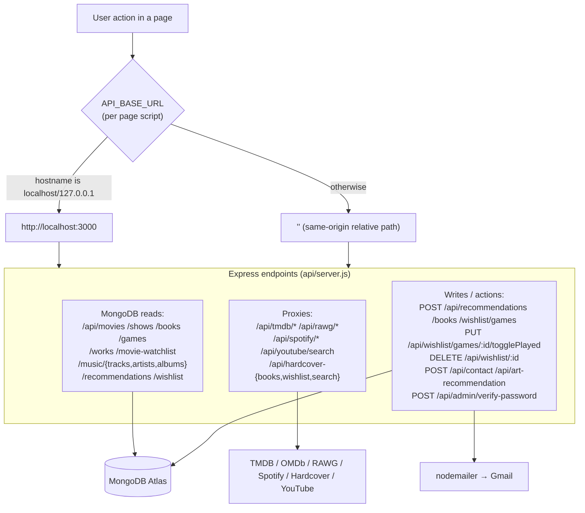
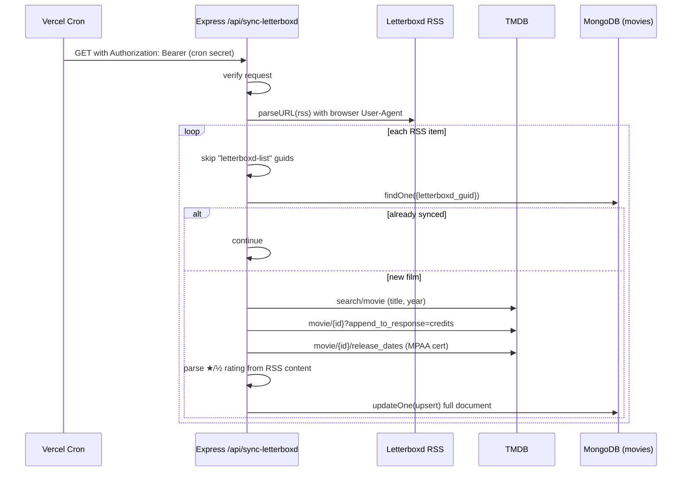

# Interactive Portfolio (V2)
### A pixel-art "digital room" front-end backed by a Node/Express + MongoDB API and live media-API proxies


---

## Table of Contents

1. [Project Overview](#1-project-overview)
2. [Content & Data Sources](#2-content--data-sources)
3. [Architecture](#3-architecture)
   - [3.1 Component / Deployment Architecture](#31-component--deployment-architecture)
   - [3.2 Build & Deploy Pipeline (Vercel)](#32-build--deploy-pipeline-vercel)
   - [3.3 Request / Routing Map](#33-request--routing-map)
   - [3.4 Letterboxd Sync Data Flow](#34-letterboxd-sync-data-flow)
4. [Repository Structure](#4-repository-structure)
5. [Libraries & Frameworks](#5-libraries--frameworks)
6. [Methodology — The Render & Data Pipeline](#6-methodology--the-render--data-pipeline)
7. [Setup & Installation](#7-setup--installation)
8. [Environment Variables Reference](#8-environment-variables-reference)
9. [Running the Project](#9-running-the-project)
10. [Features](#10-features)
11. [Roadmap & Future Work](#11-roadmap--future-work)
12. [Appendix — Glossary & References](#12-appendix--glossary--references)

---

## 1. Project Overview

**PortfolioV2** is an interactive portfolio website built as a playful pixel-art "digital room." Instead of a conventional scrolling résumé, the home page (`client/index.html`) renders a layered illustration of a room where each object (ukulele, movie posters, PS5, painting, bookshelf, etc.) is a clickable hotspot that navigates to a themed section page.

It is a **two-tier full-stack application**, not a static site:

- **Front-end** — hand-written **HTML5 + CSS3 + vanilla ES6+ JavaScript** (no build step, no framework). One HTML file per section, each with its own CSS and JS file. Several pages pull in CDN libraries (Three.js, GSAP, Turn.js, jQuery, Tailwind, Lucide, marked.js, PapaParse) and the YouTube IFrame API.
- **Back-end** — a single **Node.js / Express** server (`api/server.js`) connected to **MongoDB Atlas**. It serves curated media data from MongoDB collections and acts as a **secure proxy** to external media APIs (TMDB, OMDb, RAWG, Spotify, Hardcover, YouTube) so that API keys never reach the browser. It also handles a **contact form** and an **art-recommendation form** via `nodemailer`.
- **Automation** — a **Vercel Cron** job calls `/api/sync-letterboxd` on a schedule, which reads a public Letterboxd RSS feed, enriches each new film via TMDB, and upserts it into MongoDB — a small ETL pipeline that keeps the movie diary current with no manual work.

The whole application is deployed on **Vercel**: the `client/` folder is served as static assets and `api/server.js` runs as a serverless Node function, wired together by `vercel.json`.

> **In one sentence:** a game-like portfolio front-end whose dynamic sections (movies, TV, games, music, books) are fed by a thin Express/MongoDB backend that proxies public media APIs and auto-syncs a Letterboxd movie diary.

---

## 2. Content & Data Sources

Page content comes from **three** distinct places — knowing which is which is the key to understanding the app.

| Source | Used by | Mechanism | Examples |
|---|---|---|---|
| **MongoDB Atlas collections** | Movies, Shows, Books, Games, Music, Works, Watchlist, Recommendations | Express `GET /api/<collection>` → `db.collection(...).find(...)` | `movies`, `shows`, `books`, `games`, `music_tracks`, `music_artists`, `music_albums`, `works`, `movie_watchlist`, `recommendations` |
| **Live external APIs (proxied through the server)** | Search & detail lookups, trailers, covers | Browser → `/api/tmdb/*`, `/api/rawg/*`, `/api/spotify/*`, `/api/hardcover-*`, `/api/youtube/search` → Express → upstream API | TMDB search/details, RAWG game search, Spotify search, Hardcover GraphQL, YouTube trailer fallback |
| **Static data inside the JS files** | Food/recipes, Projects (XP desktop), the Art gallery layout, the Sport mini-games | Plain JS objects/arrays in the page script | `recipes.js` (~23 recipes), `projectscript.js` file-system tree, `artscript.js` artwork positions, game physics in `basketball.js` / `golf.js` / `martialarts.js` |

### The MongoDB collections are seeded from CSVs

The `data/` folder holds exported media history as CSV, and `api/migrate.js` loads them into MongoDB (drop-then-`insertMany` per collection). Representative row counts (header + data):

| CSV file | → Collection | Rows | Notable columns |
|---|---|---|---|
| `movies_data.csv` | `movies` | ~704 | tmdb_id, title, user_rating, director, actors, poster, metascore |
| `shows_data.csv` | `shows` | ~134 | tvmaze_id, genres, my_rating, number_of_seasons |
| `books_data.csv` | `books` | ~73 | title, my_rating, authors, thumbnail, infoLink |
| `games_data.csv` | `games` | ~374 | name, my_rating, metacritic, platform_from_text, cover |
| `my_works.csv` | `works` | ~522 | title, text (paginated for the in-site reader) |
| `watchlist.csv` | `movie_watchlist` | ~399 | Letterboxd export: Date, Name, Year, Letterboxd URI |
| `spotify_top_tracks.csv` | `music_tracks` | ~9938 | Track Name, Artist(s), Genre(s), Track URL |
| `spotify_top_artists.csv` | `music_artists` | ~720 | Artist Name, Followers, Image_URL |
| `spotify_saved_albums.csv` | `music_albums` | ~102 | Album Name, my_rating, Image_URL |

> **Note:** `data/` is git-ignored. A fresh clone ships code only — supply your own CSV exports and run `npm run migrate` to populate Atlas.

---

## 3. Architecture

### 3.1 Component / Deployment Architecture


*Figure 1 — Component & deployment architecture. The browser only ever talks to Vercel; all keyed external APIs are reached through the Express function so credentials stay server-side. The one exception is Open Library, which is keyless and called directly from the browser as a cover/metadata fallback.*

### 3.2 Build & Deploy Pipeline (Vercel)


*Figure 2 — Build & deploy pipeline. The static client is shipped verbatim and only the API is packaged as a Node serverless function. `vercel.json` declares the two builds, the route table, and the scheduled cron.*

### 3.3 Request / Routing Map


*Figure 3 — Routing map. Each page script computes `API_BASE_URL` at runtime: it points to `http://localhost:3000` in local dev and to a relative same-origin path in production (so the deployed Vercel function answers). Endpoints split cleanly into MongoDB reads, keyed-API proxies, and write/action handlers.*

### 3.4 Letterboxd Sync Data Flow


*Figure 4 — Letterboxd → MongoDB ETL. The endpoint is authenticated, filters out Letterboxd "list" activity (which otherwise matches incorrect TMDB results), and upserts by `letterboxd_guid` so the job is idempotent and resumable.*

---

## 4. Repository Structure

```text
PortfolioV2/
├── README.md                      # This file
├── package.json                   # Backend deps + npm scripts (start, migrate, import-watchlist, ...)
├── package-lock.json
├── vercel.json                    # Vercel builds, route table, cron definition
├── update_spotify_data.py         # One-off Python: fills Image_URL columns in the Spotify CSVs
├── .gitignore                     # Ignores node_modules, env files, data/, venv/
│
├── api/                           # ── BACKEND (Express serverless function) ──
│   ├── server.js                  # The whole API: MongoDB reads, API proxies, contact/art mail, wishlist CRUD
│   ├── letterboxd-sync.js         # Letterboxd RSS → TMDB enrich → MongoDB upsert
│   ├── migrate.js                 # CSV → MongoDB loader (drop + insertMany per collection)
│   ├── import-watchlist.js        # Loads ONLY watchlist.csv into movie_watchlist (re-runnable)
│   ├── export-to-hardcover.js     # One-off: pushes MongoDB books onto the Hardcover "Read" shelf (dry-run by default)
│   └── clear-hardcover-dates.js   # Maintenance script for Hardcover date fields
│
├── client/                        # ── FRONTEND (static, no build) ──
│   ├── index.html                 # Pixel-room hub: clickable assets, canvas loader, YouTube ambient music
│   ├── MoviesTV.html              # Netflix-style movies/TV/anime browser
│   ├── Games.html                 # PlayStation-style game carousel + wishlist
│   ├── Music.html                 # Turntable + record crate (GSAP)
│   ├── Literature.html            # Bookshelf + Turn.js reader (Hardcover + Open Library)
│   ├── art.html                   # Three.js first-person 3D art gallery
│   ├── Sport.html                 # Arcade hub: basketball / golf / martial-arts mini-games
│   ├── Travel.html                # Turn.js page-flip scrapbook
│   ├── Food.html                  # Retro diner menu with recipe modals
│   ├── Projects.html              # Windows-XP-style desktop with simulated apps
│   ├── CSS/                       # One stylesheet per page (indexstyle, moviestvstyle, gamestyle, ...)
│   ├── Javascript/                # One script per page + helpers (recipe.js, recipes.js, papaparse.min.js)
│   └── assets/                    # Images, audio, video, Resume.pdf, project README files (md/pdf)
│
├── data/                          # CSV exports (git-ignored) — source for npm run migrate
│   ├── movies_data.csv  shows_data.csv  books_data.csv  games_data.csv
│   ├── my_works.csv  watchlist.csv
│   └── spotify_top_tracks.csv  spotify_top_artists.csv  spotify_saved_albums.csv
│
└── files/                         # Standalone sport mini-game HTML (basketball/golf/martialarts/Sports)
```

`node_modules/` and `venv/` are present locally but git-ignored. The `venv/` exists only for the one-off `update_spotify_data.py` script (uses `requests`).

---

## 5. Libraries & Frameworks

### Backend (npm — from `package.json`)

| Package | Version | Role in this project |
|---|---|---|
| `express` | ^4.22.1 | HTTP server, routing, JSON middleware |
| `mongodb` | ^6.21.0 | Official driver; connects to Atlas with `serverApi v1`, reads/writes `portfolioData` |
| `axios` | ^1.6.8 | All server→external-API HTTP calls (TMDB, OMDb, RAWG, Spotify, Hardcover, YouTube) |
| `cors` | ^2.8.5 | Allows the static front-end (and localhost) to call the API |
| `dotenv` | ^16.6.1 | Loads environment variables in local development |
| `nodemailer` | ^6.9.13 | Sends contact-form and art-recommendation emails via Gmail |
| `node-cron` | ^4.2.1 | In-process scheduler utility |
| `rss-parser` | ^3.13.0 | Parses the Letterboxd RSS feed |
| `csv-parser` | ^3.2.0 | Streams CSVs in the migrate/import scripts |

### Frontend (CDN-loaded, per page)

| Library | Loaded on | Used for |
|---|---|---|
| **YouTube IFrame API** | index, MoviesTV, Games, Food | Ambient background music + trailer playback |
| **Three.js r128** | art.html, Sport.html (basketball) | WebGL 3D gallery; 3D basketball court |
| **GSAP 3.12** | Music.html | Record-crate / turntable animations |
| **Turn.js + jQuery 3.3.1** | Literature.html, Travel.html | Page-flip book/scrapbook effect |
| **Tailwind CSS** | Music, Literature, Sport | Utility-class styling on those pages |
| **Lucide** | Music, Literature | Icon set |
| **marked.js** | Projects.html | Renders project README markdown in the simulated browser |
| **PapaParse** | Games, Literature | Client-side CSV parsing helper |
| **Font Awesome 6** | most pages | Icons (also drawn onto the home-page loader canvas) |

The core front-end is otherwise **plain HTML5 / CSS3 / ES6+** with the Canvas 2D API and the Gamepad API (games), no framework and no bundler.

---

## 6. Methodology — The Render & Data Pipeline

The repeating lifecycle, end to end:

1. **Seed (one-time / occasional).** Media history is exported to `data/*.csv`. `npm run migrate` (`api/migrate.js`) streams each CSV with `csv-parser`, drops the target collection, and `insertMany`s the rows into `portfolioData` on MongoDB Atlas.
2. **Serve static.** Vercel serves `client/` verbatim. The browser loads an HTML page plus its single CSS and JS file and any CDN libraries.
3. **Boot the page.** Each page script computes `API_BASE_URL` (`localhost:3000` in dev, relative in prod) and `fetch`es its data from the Express function.
4. **Read or proxy.** For owned data the server returns a MongoDB collection. For search/detail/trailer lookups the server proxies the upstream API with the server-held key, applying fallbacks (e.g. TMDB → OMDb) and normalization (Hardcover → the same shape as `/api/books`).
5. **Render.** The script builds DOM (Netflix rows, game carousel, record crate, bookshelf, XP desktop) or a Canvas/WebGL scene. Trailers and music embed via the YouTube IFrame API.
6. **Write actions.** Visitor-driven writes (recommend a book/game, send a contact or art message) `POST` to the server, which validates, applies admin gating where applicable, then writes to MongoDB or emails via nodemailer.
7. **Auto-refresh (scheduled).** Vercel Cron hits the authenticated `/api/sync-letterboxd`, which reads the Letterboxd RSS feed, enriches new films via TMDB, and upserts them into the `movies` collection.

---

## 7. Setup & Installation

### Prerequisites

| Dependency | Version | Notes |
|---|---|---|
| Node.js | 18+ (LTS) | Runs Express; matches Vercel's Node runtime |
| npm | bundled with Node | Installs backend deps |
| MongoDB Atlas | free tier ok | Cluster + connection string for `portfolioData` |
| Python | 3.8+ | **Only** for the optional `update_spotify_data.py` script |
| API keys | — | TMDB (required), RAWG (required), OMDb (optional fallback), Spotify, Hardcover, YouTube (optional) |

### Steps

```bash
# 1. Clone and install backend dependencies
git clone <your-repo-url> PortfolioV2
cd PortfolioV2
npm install

# 2. Configure environment variables (see §8 for the full reference)
#    At minimum: MONGO_URI, TMDB_API_KEY, RAWG_API_KEY

# 3. Provide your CSV exports in data/ (git-ignored), then seed MongoDB
npm run migrate            # loads all CSVs
# or, for just the Letterboxd watchlist:
npm run import-watchlist
```

> The server **fails fast** if required keys (`TMDB_API_KEY`, `RAWG_API_KEY`, and the admin gate) are missing. `OMDB_API_KEY` and `YOUTUBE_API_KEY` only warn — their features degrade gracefully.

---

## 8. Environment Variables Reference

All configuration is supplied via environment variables — locally through a git-ignored env file, and in production through Vercel's project environment settings. No secrets are committed to the repository.

| Variable | Required? | Description |
|---|---|---|
| `MONGO_URI` | ✅ | MongoDB Atlas connection string (db `portfolioData`) |
| `TMDB_API_KEY` | ✅ | The Movie Database — movie/TV data (server exits without it) |
| `RAWG_API_KEY` | ✅ | RAWG — game data (server exits without it) |
| `WISHLIST_PASSWORD` | ✅ | Server-side gate for admin actions (toggle played, verify-password, add book) |
| `OMDB_API_KEY` | ⚠️ optional | OMDb fallback when TMDB returns nothing / errors |
| `SPOTIFY_CLIENT_ID` / `SPOTIFY_CLIENT_SECRET` | optional | Client-credentials token for Spotify search/artist/album proxies |
| `HARDCOVER_API_KEY` | optional | Bearer token for the Hardcover GraphQL book endpoints |
| `YOUTUBE_API_KEY` | optional | Trailer fallback search; returns `{videoId:null}` if absent |
| `EMAIL_USER` / `EMAIL_PASS` / `EMAIL_TO` | optional | Gmail (app password) for contact + art-recommendation mail |
| `CRON_SECRET` | optional | Shared secret Vercel Cron sends as `Authorization: Bearer ...` |
| `PORT` | optional | Local port (default 3000) |

> The env file is git-ignored by design; configure these values in your local environment and in the Vercel dashboard for production.

---

## 9. Running the Project

### Local development

```bash
# Start the API (defaults to http://localhost:3000)
npm start                  # node api/server.js
```

Then open `client/index.html` — either with a simple static server (e.g. VS Code Live Server / `npx serve client`) or directly. Because each page script detects `localhost`, it will call the API at `http://localhost:3000` automatically.

### Data scripts

```bash
npm run migrate                 # CSV → MongoDB (all collections)
npm run import-watchlist        # only watchlist.csv → movie_watchlist
npm run export-hardcover        # dry-run export of books to Hardcover (add --commit to write)
node api/letterboxd-sync.js     # (module) — sync is normally triggered via the API/cron
python update_spotify_data.py   # optional: backfill Image_URL columns in the Spotify CSVs
```

### Deploy

Push to the Git repo connected to Vercel. `vercel.json` builds `client/**/*` as static and `api/server.js` as a Node function, applies the route table, and registers the Letterboxd cron. Set all environment variables in the Vercel dashboard.

---

## 10. Features

- **Interactive pixel-room hub** with a Canvas loader (mouse-reactive Font-Awesome icon field with DVD-style bouncing + elastic collisions), escalating "he's busy" wait messages, and a 3-message welcome sequence.
- **Movies & TV** — Netflix-style billboard with YouTube trailers, dynamic content rows, global search (TMDB with OMDb fallback), detail modals with cast/seasons, and a visitor recommendation flow.
- **Games** — PlayStation-style cover carousel with gamepad + keyboard + touch input, YouTube/RAWG trailer resolution, and a password-protected wishlist (toggle "played").
- **Music** — GSAP record-crate "dig," turntable with animated tonearm, top tracks/artists from MongoDB (seeded from Spotify exports), live Spotify search proxy.
- **Literature** — bookshelf rendering the Hardcover "Read" shelf, MongoDB + Hardcover "Want to Read" wishlist, Hardcover search to recommend, and a Turn.js reader for the owner's own `works`.
- **Art** — first-person **Three.js** 3D gallery (WASD + pointer-lock, mobile joysticks), with an email-based art-recommendation form.
- **Sport** — three from-scratch mini-games: 3D basketball (Three.js), 2D golf (9 holes, wind, swing meter), 2D martial-arts fighter (combos, Web Audio SFX).
- **Travel** — Turn.js page-flip scrapbook (responsive single-page on mobile).
- **Food** — retro diner menu with recipe modals.
- **Projects** — a simulated Windows-XP desktop with a window manager and toy apps (CMD, Notepad, Calculator, Paint, IE, Minesweeper), rendering project READMEs via marked.js.
- **Backend** — secure API-key proxying, contact + art mailers, idempotent Letterboxd ETL, CSV→Mongo migration.

### Design characteristics

- **Zero front-end build** — pages ship as authored, making the site fast to deploy and straightforward to debug.
- **Secrets stay server-side** — every keyed API is proxied; the browser never sees a key (Open Library is the one keyless exception, called directly).
- **Graceful degradation** — TMDB→OMDb fallback, optional keys, and the cron returning cleanly when unconfigured.
- **Idempotent automation** — the Letterboxd sync upserts by GUID, so the scheduled job is safe to re-run.

---

## 11. Roadmap & Future Work

Potential enhancements for future iterations:

- **Front-end build pipeline** — introduce bundling/minification and shared modules to reduce duplicated boilerplate (e.g. the `API_BASE_URL` snippet repeated across page scripts).
- **Automated testing** — add a unit/integration test suite for the API endpoints and data scripts.
- **Expanded authentication** — extend the admin gate into a fuller session-based auth system for richer content-management workflows.
- **Read caching** — add a caching layer for frequently requested MongoDB collections to reduce database round-trips.
- **Accessibility & SEO** — broaden semantic markup, ARIA coverage, and metadata across the interactive pages.

---

## 12. Appendix — Glossary & References

| Term | Meaning in this project |
|---|---|
| **Proxy endpoint** | An Express route that forwards a browser request to a keyed external API so the key stays on the server |
| **`API_BASE_URL`** | Per-page constant: `http://localhost:3000` in dev, relative same-origin in prod |
| **Upsert** | `updateOne(..., {upsert:true})` — insert if absent, update if present (used by the Letterboxd sync, keyed on `letterboxd_guid`) |
| **Migration** | `npm run migrate` — drop + `insertMany` each collection from its CSV |
| **Vercel Cron** | Platform-scheduled GET to `/api/sync-letterboxd` |
| **Static build** | `@vercel/static` serving `client/` with no transpilation |
| **Serverless function** | `@vercel/node` packaging `api/server.js` |

**References:** [Express](https://expressjs.com/) · [MongoDB Node Driver](https://www.mongodb.com/docs/drivers/node/) · [Vercel config](https://vercel.com/docs/projects/project-configuration) · [TMDB API](https://developer.themoviedb.org/) · [OMDb](http://www.omdbapi.com/) · [RAWG](https://rawg.io/apidocs) · [Spotify Web API](https://developer.spotify.com/documentation/web-api) · [Hardcover GraphQL](https://hardcover.app/) · [Open Library](https://openlibrary.org/developers/api) · [Three.js](https://threejs.org/) · [GSAP](https://gsap.com/) · [Turn.js](http://www.turnjs.com/) · [YouTube IFrame API](https://developers.google.com/youtube/iframe_api_reference)

---

<div align="center">
  <sub>PortfolioV2 — an interactive pixel-room portfolio · vanilla front-end + Express/MongoDB backend on Vercel</sub>
</div>
