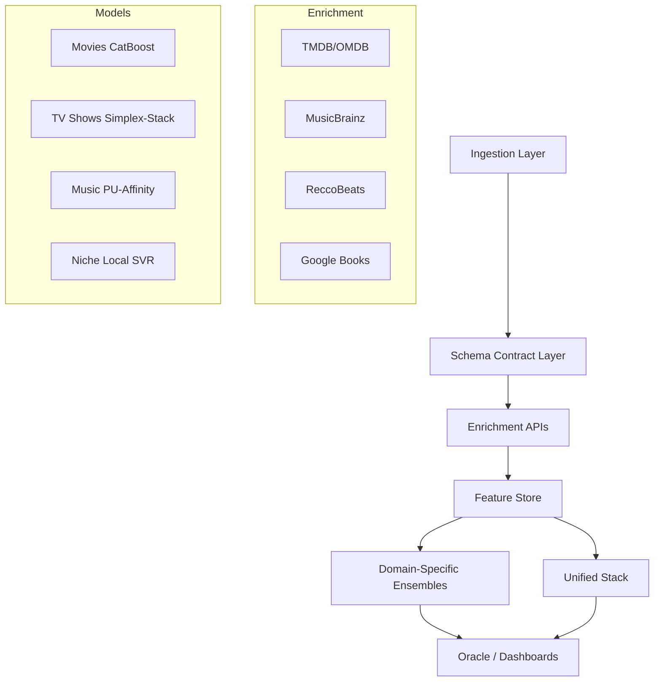

# Personal Media Intelligence Hub

## Table of Contents
- [Introduction](#introduction)
- [Architecture](#architecture)
- [Key Features](#key-features)
- [Engineering Highlights](#engineering-highlights)
- [Performance Benchmarks](#performance-benchmarks)
- [Technology Stack](#technology-stack)
- [Setup and Installation](#setup-and-installation)
- [Unified Media Intelligence](#unified-media-intelligence)
- [Dashboards & Visualizations](#dashboards--visualizations)
- [The Oracle (Explainable Recommendations)](#the-oracle-explainable-recommendations)

## Introduction
The **Personal Media Intelligence Hub** is a sophisticated "Global Taste Engine" designed to map, analyze, and predict personal entertainment preferences across five distinct domains: Movies, TV Shows, Music, Games, and Books. By consolidating fragmented media consumption data and enriching it with high-fidelity metadata from external APIs, the system builds a unified semantic representation of "Taste" that allows for cross-domain discovery and explainable recommendations.

## Case Study: When fixing the evaluation made the numbers worse

A crucial part of this project involved recognizing and correcting inflated metrics in data-sparse domains (Games and Books, N ≈ 60). Initially, a single validation split suggested a promising R² of ~0.45. However, this was a statistical artifact. 

By migrating to a rigorous **10-fold × 5-repeat Cross-Validation** protocol, the true signal emerged: an R² near 0.0. While superficially disappointing, this was a critical finding:
1.  **Metric Treachery:** In domains where ratings cluster tightly (e.g., 3.0 to 4.5), variance is tiny. R² becomes highly sensitive to noise, hovering near zero even when the Mean Absolute Error (MAE) is genuinely useful.
2.  **The Distillation Prior — tested and dropped:** We hypothesized the unified model could anchor these sparse domains as a prior feature. A paired Wilcoxon ablation on the frozen folds said otherwise (p = 0.21 Games / 0.18 Books, both ≥ 0.05): the prior was removed. What *did* emerge once it was gone were positive **skill scores** (Games 0.225, Books 0.108) — the local models beat the mean-rating baseline, the first evidence of genuine local signal at N ≈ 60 even with R² ≈ 0.
3.  **The Pivot to Skill Score:** We reframed the evaluation metric from R² to **Skill Score** (`1 - MAE_model / MAE_baseline`), focusing on whether the system adds value over a simple historical average. 
4.  **Uncertainty & Acquisition:** We shifted the focus for these domains from raw accuracy to active learning. By surfacing **split-conformal prediction intervals** (e.g., "3.5 ± 1.3"), the Oracle now explicitly quantifies its uncertainty, guiding the user to deliberately rate the most informative backlog items to efficiently bridge the data gap.
5.  **Ablation Discipline:** We explicitly tested residual-head domain correction and Ridge-based stacking using paired Wilcoxon tests. Both were found to be actively destructive (destroying ~0.09 R²), leading to their removal in favor of a simpler, more robust Mean Ensemble.

Reviewers see inflated metrics daily; accurately deflating them and extracting a robust path forward demonstrates true ML maturity.

## Case Study: Does taste transfer across domains?

The project's central question. Two sub-stories:

**1. The reporting-spine bug that flipped a conclusion.** The benchmark table once published the *unified model's per-domain OOF slice* as if it were the standalone local models — with N inflated 5× (OOF rows counted as items) and the local-model names glued on top. Repairing the writer (`assert benchmarks != slices`, per-item dedup, `assert N == n_unique_items`) didn't just fix labels: it forced standalone and unified to be measured with the **same estimator on the same folds**. The result *reversed* the tempting "naive pooling loses in every domain" reading — on a like-for-like MAE comparison the unified model is competitive with or better than the local model in **movies, TV and books**, and clearly worse only in **Games**. The earlier impression was an artifact of comparing a pooled-OOF slice against standalone numbers from a more generous estimator. The bug, and its fix, *changed the scientific conclusion* — which is exactly why the single-source-of-truth renderer exists.

**2. The pre-registered transfer grid.** We then asked the sharper question — not "does the pooled model win on average" but *which specific source-domain combinations* transfer into which targets, zero-shot and augmented, in the shared feature space. The decision rules were **pre-registered before any result was seen** (positive finding ⇔ augmented lift > 0, paired p < 0.05, at ≥ 2 target fractions). <!-- TRANSFER_VERDICT:BEGIN -->**Realized verdict (pilot): NULL.** No source combination cleared the bar (augmented lift > 0 *and* paired p < 0.05 at ≥ 2 fractions) for any target — so in the shared feature space, no domain blend beats the local model. There *are* suggestive, non-significant signals worth the full grid: positive zero-shot skill from movies into TV (0.19) and Games (0.16), and an augmented lift of +0.20 into Games from *movies+TV+books* — none significant under the reduced-power pilot (6 folds). Aligned-space domain distance does **not** predict transfer (Spearman ≈ −0.10, n=12). The honest reading: cross-domain taste signal, if it exists, is **item-level, not feature-level pooling** — which is exactly what the entity-bridge experiment probes. Full results in the **Transfer Atlas** page and `reports/transfer_grid_summary.json`.<!-- TRANSFER_VERDICT:END --> Designing and pre-registering a paired-significance transfer study — and reporting whatever it returns, positive or null — is the stronger result either way.

## Architecture

## Dataset Schemas

The system orchestrates a multi-domain data lake with strictly enforced schema contracts. Each domain is enriched from specialized APIs before being projected into a **397-feature** shared latent space (aligned via CORAL).

### 🎬 Movies (TMDB/OMDB)
| Category | Features |
| :--- | :--- |
| **Numerical** | Year, Runtime, IMDb Rating/Votes, Metascore, RT%, Box Office (Log), Popularity, Awards (Wins/Noms) |
| **Categorical** | Language, Genres (Multi-hot), MPAA Rating (Adult/Teen/General) |
| **Relational** | Target-encoded Directors, Actors, and Director-Genre interactions |
| **Vibe (NLP)** | 384-d MiniLM-L6-v2 Embeddings reduced to 10 PCA components from Plot + Cast + Director |

### 📺 TV Shows (TMDB)
| Category | Features |
| :--- | :--- |
| **Numerical** | Year, Vote Average, Vote Count (Log), Season Count |
| **Categorical** | Network (Top 10), Genres (Freq-gated), Age Rating (is_adult) |
| **Vibe (NLP)** | 384-d MiniLM-L6-v2 Embeddings (15 PCA components) on Show Overviews |

### 🎵 Music (MusicBrainz/ReccoBeats)
| Category | Features |
| :--- | :--- |
| **Numerical** | Release Year, Popularity, PU-calibrated Affinity Rating |
| **Categorical** | Artist Genres (Multi-hot), Artist Name |
| **Metadata** | Track ID, Album Name, MB-Tags |

### 🎮 Games (RAWG)
| Category | Features |
| :--- | :--- |
| **Numerical** | Year, Metacritic Score, Global Rating, Ratings/Reviews Count |
| **Categorical** | Platforms, Genres, Developers (Multi-hot, Freq >= 2) |
| **Vibe (NLP)** | MiniLM-L6-v2 Embeddings (15 PCA components) from Name + Tags + Description |

### 📚 Books (Google Books)
| Category | Features |
| :--- | :--- |
| **Numerical** | Year, Page Count, Average Rating, Ratings Count |
| **Categorical** | Authors, Categories (Multi-hot, Freq >= 2) |
| **Vibe (NLP)** | MiniLM-L6-v2 Embeddings (15 PCA components) from Title + Authors + Description |

### 📺 YouTube (YouTube Data API v3)
| Category | Features |
| :--- | :--- |
| **Video** | Video ID, Duration, Tags, Description, Views, Likes, Comment Count |
| **Channel** | Channel ID, Title, Subscriber Count, Video Count |

### 🌐 Unified Schema (Cross-Domain)
The **Unified Model** aligns all domains by mapping heterogeneous fields to a common backbone:
- **Identity:** `media_type` indicator + `has_{domain}_feats` binary masks.
- **Narrative:** Shared 10-d PCA Vibe space from unified text content.
- **Commercial:** Log-normalized Box Office / Budget / Popularity proxies.
- **Quality:** Critic-average-5 (blended normalization of IMDb, RT, Metascore, and RAWG/Google ratings).

## Key Features
- **Consolidated Library:** A single-pipeline architecture managing over **1,250 rated items** across four domains and **3,600+ music tracks**.
- **Advanced ML Ensemble:** Combines XGBoost and CatBoost through a Simplex-constrained Mean Ensemble for robust cross-domain fusion.
- **Explainable Oracle:** Predicts star ratings and provides "Verdicts" based on SHAP waterfall explanations and semantic similarity.
- **Taste Diversity Analytics:** Tracks **Taste Entropy** (Shannon Diversity) and temporal drift across your library.
- **Multi-Modal Fusion:** Integrates acoustic features, episodic metadata, and plot vibes into a 397-feature shared latent space.

## Engineering Highlights

- **Domain Centroid Alignment (CORAL):** Corrects domain shift in the shared embedding space by centering embeddings per media type, ensuring that "vibes" are comparable across Movies, Games, and Books.
- **Frozen-Fold Evaluation Registry:** Uses a deterministic `fold_registry.json` to ensure all cross-validation experiments use identical splits, eliminating metric drift and enabling paired statistical testing.
- **Asymmetric Edge-Penalty Loss:** Custom XGBoost objective derived to penalize errors more heavily at the extremes (favorites and hard passes).
  $$L(e, r) = \frac{1}{2}e^2 \cdot \exp(\alpha_{hi} \cdot \max(0, r - 4.0) + \alpha_{lo} \cdot \max(0, 1.5 - r))$$
- **Joint Optuna Tuning:** Hyperparameters and asymmetric penalty coefficients are jointly optimized under **5×2 Repeated Cross-Validation**.
- **Positive-Unlabeled (PU) Learning:** Solves the implicit feedback problem for music by sampling pseudo-negatives and using quantile calibration to map affinity to pseudo-ratings.
- **Distillation Prior (tested, then removed):** We evaluated feeding the Unified Model's predictions into the Games/Books local SVRs as a prior feature. A paired Wilcoxon ablation on the frozen folds found it **not significantly helpful** (p = 0.21 / 0.18, effect direction negative), so the prior was **dropped** — the local SVRs run on their own features. Killing a feature that doesn't earn its keep is the point, not a regression.
- **Temporal Taste Decay:** Implementation of floored exponential sample weighting ($w_i = \max(\exp(-\lambda \Delta t_i), w_{min})$). Tuning revealed preferences are remarkably stable over the library's horizon (half-life ≈ 4.4 years).

## Performance Benchmarks

<!-- BENCHMARKS:BEGIN -->
| Domain | N | Model | R² (CV mean) | MAE | ±0.5★ Accuracy |
| :--- | :--- | :--- | :--- | :--- | :--- |
| **Movies** | 980 | XGBoost | **0.524** | 0.502 | 77.9% |
| **Unified (rated)** | 1,264 | Mean Ensemble | **0.443** | 0.542 | 75.6% |
| **Unified (full pool)**† | 4,952 | Mean Ensemble (+music pool) | **0.498** | 0.411 | 80.4% |
| **TV Shows** | 159 | Simplex-Stack | **0.063** | 0.814 | 52.8% |
| **Games** | 55 | Local SVR | **0.364** | 0.636 | 61.8% |
| **Books** | 63 | Local SVR | **0.182** | 0.548 | 76.2% |

*The four domain rows are the **standalone local models** on the frozen registry folds (one row per item, N = unique items). The two Unified rows are the cross-domain Mean Ensemble; **the rated row (N=1,264) is the headline taste metric**.*

*†Unified (full pool) is trained on the rated items **plus 3,688 music PU pseudo-labels** and evaluated including music via a separate RepeatedKFold(5×1) — music has no frozen registry. It is **not an actual-taste metric** and is shown only for transparency; never cite it as the unified result.*
<!-- BENCHMARKS:END -->

*Note: Metrics reflect robust 10-fold × 5-repeat cross-validation with frozen folds. All numbers render from `reports/latest_metrics.json` via `src/reporting/render_docs.py`; the raw terminal outputs of every pipeline run are captured in [`reports/PIPELINE_RUN_LOG.md`](reports/PIPELINE_RUN_LOG.md).*

## Technology Stack
- **UI/Frontend:** Streamlit, Vanilla CSS, Plotly.
- **Core ML:** XGBoost, CatBoost, Scikit-Learn, Optuna, SHAP.
- **NLP:** SentenceTransformers (`all-MiniLM-L6-v2`), UMAP.
- **Data:** Pandas, Pydantic (Schema Contracts), Joblib.
- **APIs:** TMDB, OMDb, RAWG, Google Books, YouTube Data API v3, ReccoBeats, MusicBrainz.

## Dashboards & Visualizations
- **Latent Space Explorer:** UMAP projection of the 384-d semantic space, clustering items by "vibe."
- **Model Calibration:** Reliability diagrams binned by prediction confidence to ensure "honest" metrics.
- **Taste Drift Timeline:** 90-day rolling Shannon entropy over genre distributions.
- **SHAP Waterfall:** Per-prediction explainability in the Oracle UI.
- **Transfer Atlas:** Cross-domain affinity heatmap, augmented learning curves, and the similarity↔transfer scatter — the centerpiece of the transfer study.

## Limitations
Honest constraints, stated plainly:
- **Aleatoric ceiling.** Ratings are self-reported on a 0.5★ grid; intrinsic noise caps achievable R²/MAE, especially after rounding. MAE-skill is the more honest yardstick in low-variance domains.
- **Small-N domains.** Games (N≈55–62) and Books (N≈63) are pilots, not production claims; their R² is treacherous (near-zero variance), so we lead with skill score and conformal intervals, and the entity-bridge result is explicitly framed as a pilot with CIs.
- **PU pseudo-label caveat.** Music has no ground-truth ratings; its "ratings" are PU-classifier-calibrated affinities. Any pooled metric that scores music (the *Unified (full pool)* row) is the model partly predicting another model's output — reported only as a footnoted, secondary line.
- **Single-user dataset.** Everything is one person's taste. Nothing here generalizes across users; multi-user generalization is explicitly out of scope.
- **Transfer grid scope.** The shipped grid result is a documented **pilot** (subset of the 50 registry folds, 150-tree XGB proxy for the Mean Ensemble). The harness runs the full 50-fold/300-tree grid via `transfer_study.py full`; the verdict is reproducible either way.

---
*Created and maintained by the Personal Media Intelligence Hub Team.*
